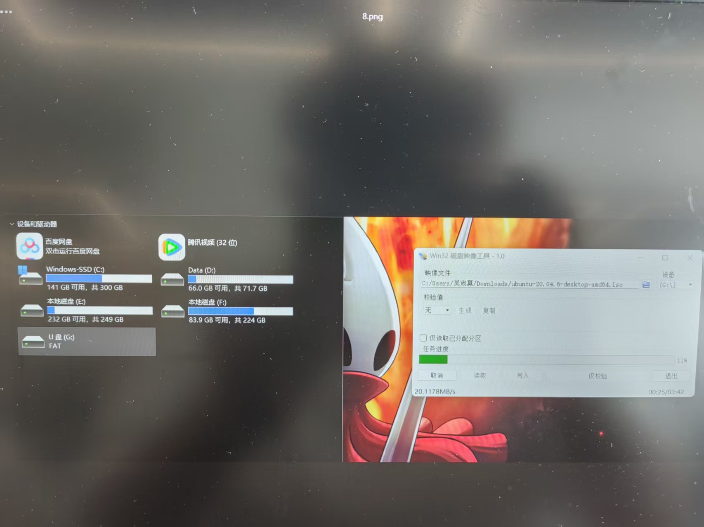
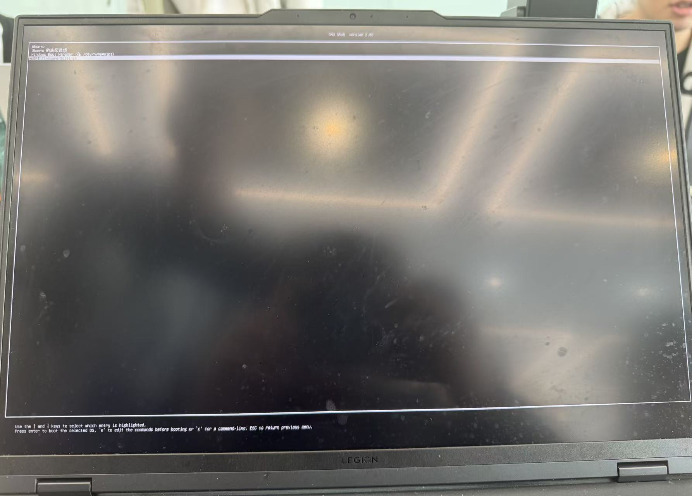
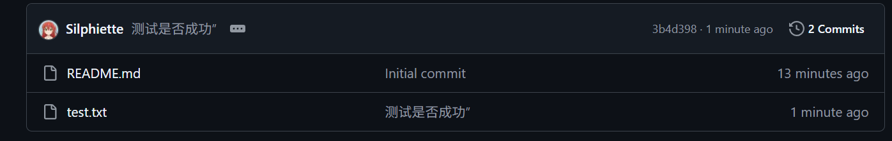

# Week1 任务实践报告
 **文件命名**:team_石嘉睿_week1_draft.md
 ## 一、实验任务
 1.安装Ubuntu+Windows11双系统启动
  - BIOS设置(UEFI、启动顺序)
  - Windows手动硬盘分区压缩与Ubuntu镜像写盘
  - 手动分区(交换分区、EFI分区、EXT4 ROOT分区)
 2.基于Ubuntu系统的VSCode的安装与配置
  - 在VSCode中进行C++以及其他插件的安装
  - 在VScode中成功运行基础程序(Hello world)
 3.完成Git学习并将作业上传到所在小组
  - 加入自己的Github小组
  - 完成基础Git命令的学习
  - 用Git基础语句将作业提交到Github对应仓库中
 4.用Markdown语句编写此周的实验报告
 ## 二、实现过程 
 - Windows手动硬盘分区压缩与Ubuntu镜像写盘：
 - Ubuntu+Windows11双系统启动：
 - 在Ubuntu系统中运行VSCode并成功运行基础程序:
 - Git与Github的绑定：、
 - 将测试文件上传到自己的Github文件中：、
 ## 三、 遇到的问题与解决方法
 1.双系统安装时无法识别Windows分区：安全启动未关闭
 解决方法：重启进入BIOS并关闭"Secure Boot"或重新启动并重新识别分区
 2.VSCode运行C++报错“无编译器”：未安装GCC工具
 解决方法：终端中执行“sudo apt install g++、gcc”命令
 3.Git Push提示“权限不足”：未配置SSH密钥
 解决方法：生成密钥”ssh-keygen -t rsa"
 ## 四、总结与心得
 本周通过完成双系统安装、VSCode 配置、Git 基础学习和 Markdown 报告编写四项核心任务，不仅掌握了实用的开发环境搭建技能，还熟悉了代码管理与文档编写的基本流程。双系统安装过程中，深入了解了 BIOS 设置、分区规划和引导配置的关键要点，学会了应对常见的启动故障；在解决问题的过程中，我深刻体会到查阅参考资料和主动排查故障的重要性，每一次问题的解决都伴随着知识点的巩固与能力的提升。后续我将继续熟练运用本周所学技能，为后续的专业学习和项目开发打下坚实的基础。
